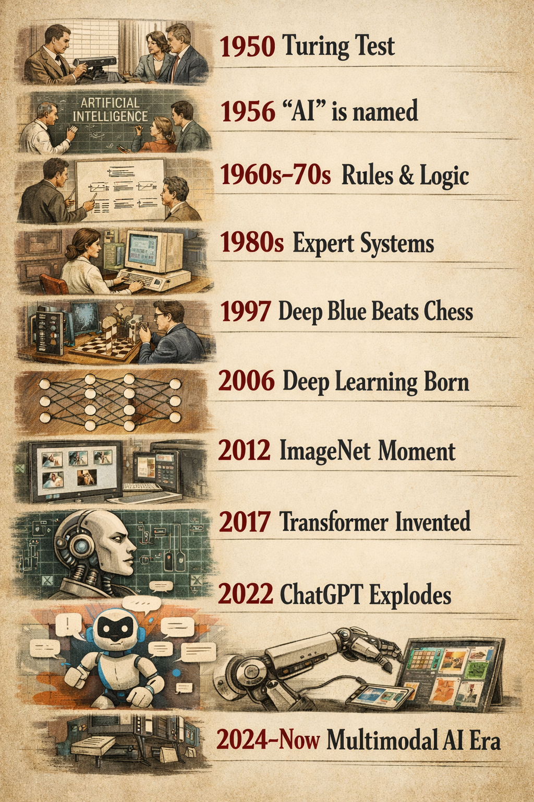
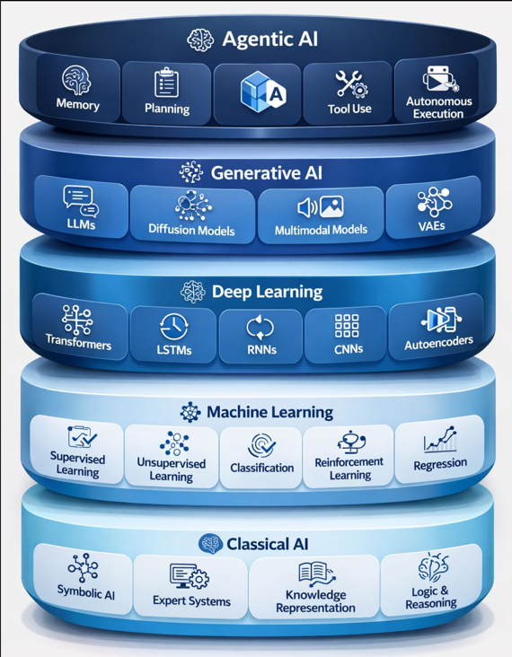

# Artificial Intelligence & Machine Learning
## Introduction Guide — From Zero to Understanding

---

> **What is this guide?**
> This guide introduces Artificial Intelligence and Machine Learning from zero to understanding.
> Click any section title below to expand or collapse it.

---

<details>
<summary><h2>1. Why AI Matters to You</h2></summary>

Before diving into definitions, look at what you already use every day:

| Your Daily Activity | What AI is Doing Behind the Scenes |
|---|---|
| Gmail auto-suggests a reply | Predicting your words |
| Netflix recommends a show | Learning your taste |
| Spam goes to your spam folder | Classifying emails |
| Your phone unlocks with your face | Recognizing patterns |
| Google Translate | Understanding language |
| ChatGPT answers your question | Generating language |

You are already using AI every single day. This course helps you understand what is actually happening under the hood.

---

</details>

## 2. The History of Artificial Intelligence

### 2.1 Where It All Began — 1950

**Alan Turing** — a British mathematician — asked a simple but profound question:

> *"Can machines think?"*

He invented the **Turing Test (thought experiment)**: if a human cannot tell whether they are talking to a machine or another human, the machine has passed the test.

This question planted the seed for everything that followed.

---

### 2.2 The AI Timeline


---

### 2.3 Each Era Explained

#### 1950 — The Birth of the Idea
Alan Turing proposed that machines could simulate human reasoning. Nobody knew how yet — but the question was asked.

#### 1956 — The Word "AI" Is Coined
At a conference in Dartmouth, **John McCarthy** officially named the field *Artificial Intelligence*. Researchers were optimistic that human-level machines were just decades away.

#### 1960s–1970s — Rules and Logic
Scientists tried to make AI by writing explicit rules:
- IF the email contains "free prize" → mark as spam
- IF traffic light is red → stop the car

This worked for narrow, simple problems. But real-world problems have too many exceptions. The rule-writing became impossible to maintain.

**Lesson learned:** You cannot write a rule for everything.

#### 1980s — Expert Systems
Instead of general AI, researchers built *specialist AI* — systems encoded with knowledge from domain experts.
- A medical AI encoded diagnostic rules from doctors.
- A financial AI encoded rules from accountants.

These were commercially successful but rigid. They could not learn or adapt. Any change required reprogramming by hand.

**Lesson learned:** Specialist systems work, but they cannot learn on their own.

#### 1997 — Deep Blue Defeats the Chess World Champion
IBM's **Deep Blue** defeated Garry Kasparov — the world chess champion. The machine did not learn chess; it was programmed to evaluate millions of positions per second. But to the public, a machine beating the best human at the world's most complex board game was shocking.

**Why it matters:** Showed machines could outperform humans in a specific, complex domain.

#### 2006 — Deep Learning is Born
**Geoffrey Hinton** (called the Godfather of AI) published research showing that neural networks — structures loosely inspired by the human brain — could learn from data in multiple layers.

This was a turning point. Instead of writing rules, the machine could now discover rules from data on its own.

**Why it matters:** Shifted the field from rule-writing to data-driven learning.

#### 2012 — The ImageNet Moment
A deep learning model called **AlexNet** entered an image recognition competition and crushed every competitor — reducing error rates by half.

AI could now look at a photo and correctly identify what was in it — cats, dogs, cars, faces — better than most humans.

**Why it matters:** Proved deep learning worked at scale. Every major tech company started investing heavily in AI.

#### 2017 — The Transformer (The Engine Behind ChatGPT)
Google researchers published a paper titled *"Attention Is All You Need."*

They introduced the **Transformer architecture** — a new way for AI to understand language by focusing on the relationships between words, not just their order.

This became the foundation of every modern language AI: GPT, Claude, Gemini, LLaMA.

**Why it matters:** Gave AI the ability to understand and generate language deeply.

#### 2022 — ChatGPT Changes Everything
OpenAI released **ChatGPT** to the public.
- 1 million users in 5 days
- 100 million users in 2 months
- The fastest adoption of any technology product in history

For the first time, ordinary people could converse with AI naturally — no coding, no setup, just a chat window.

**Why it matters:** AI stopped being a research topic and became a daily tool for everyone.

#### 2024–Now — Multimodal AI
Modern AI can now handle text, images, audio, video, and code — all in one system. Models like GPT-4o, Claude, and Gemini can look at a photo and explain it, hear a question and answer it, and generate images from a description.

**Where we are:** AI is becoming a general-purpose tool embedded in everything.

---

## 3. What is Artificial Intelligence?

### Simple Definition

**Artificial Intelligence (AI)** is the ability of a computer to perform tasks that normally require human intelligence — understanding language, recognizing images, making decisions, solving problems.

### A Better Way to Think About It

Think of AI as a spectrum:

```
NARROW AI                    GENERAL AI                  SUPER AI
(exists today)              (in research)              (theoretical)
      │                           │                          │
Does one task               Does many tasks             Exceeds humans
very well                   like humans do              in everything
      │
Email spam filter,
Face recognition,
ChatGPT conversations
```

Everything we use today is **Narrow AI** — excellent at specific tasks, but cannot generalize the way humans can.

### What AI Is NOT

| Myth | Reality |
|---|---|
| AI is conscious | AI has no awareness or feelings |
| AI understands like humans | AI finds statistical patterns |
| AI is always right | AI can be confidently wrong |
| AI will replace all jobs | AI changes jobs, creates new ones |
| AI is magic | AI is math + data + computation |

---

## 4. What is Machine Learning?

### The Core Idea

**Old way of programming:**
```
Human writes rules  →  Computer follows rules  →  Output
```

**Machine Learning:**
```
Human provides data  →  Computer learns rules  →  Output
```

The key difference: in Machine Learning, the computer figures out the rules itself from examples.

### Definition

**Machine Learning (ML)** is a subset of AI where a computer system learns patterns from data — without being explicitly programmed with every rule — and uses those patterns to make decisions or predictions on new data.

### An Analogy

Imagine teaching a child to recognize cats. You do not hand them a manual saying:
- *"Cats have four legs, pointed ears, whiskers, and fur."*

Instead, you show them many photos:
- *"This is a cat... this is a cat... this is NOT a cat... this is a cat..."*

After enough examples, the child can correctly identify cats in photos they have never seen before.

Machine Learning works the same way — with data instead of photos, and algorithms instead of a brain.

### The Three Ingredients of ML

```
      DATA            +       ALGORITHM       =       MODEL
 (Past examples)          (Learning method)       (Trained AI)

 10,000 emails              Decision Tree          Spam Filter
 labeled spam/ham      →    learns patterns   →    predicts new emails
```

### How a Model is Built

```
Step 1: Collect Data        →   Historical emails, house prices, images

Step 2: Prepare Data        →   Clean, format, label the data

Step 3: Choose Algorithm    →   Linear Regression, Decision Tree, Neural Net

Step 4: Train the Model     →   Algorithm learns patterns from data

Step 5: Evaluate            →   Test on data the model has not seen

Step 6: Deploy & Predict    →   Use the model in the real world
```

---

## 5. AI vs Machine Learning vs Deep Learning vs Generative AI




These terms are often confused. Here is how they relate:

```
┌────────────────────────────────────────────────────────┐
│                  ARTIFICIAL INTELLIGENCE               │
│  (Any machine simulating human intelligence)           │
│                                                        │
│   ┌────────────────────────────────────────────┐       │
│   │            MACHINE LEARNING                │       │
│   │  (Learns patterns from data)               │       │
│   │                                            │       │
│   │   ┌────────────────────────────────┐       │       │
│   │   │         DEEP LEARNING          │       │       │
│   │   │  (Uses neural networks)        │       │       │
│   │   │                                │       │       │
│   │   │   ┌────────────────────┐       │       │       │
│   │   │   │  GENERATIVE AI     │       │       │       │
│   │   │   │ (Creates content)  │       │       │       │
│   │   │   └────────────────────┘       │       │       │
│   │   └────────────────────────────────┘       │       │
│   └────────────────────────────────────────────┘       │
└────────────────────────────────────────────────────────┘
```

| Term | What It Means | Example |
|---|---|---|
| **AI** | Machines doing human-like thinking | Any smart software |
| **Machine Learning** | Machines learning from data | Spam filter, recommendation engine |
| **Deep Learning** | ML using brain-inspired layers | Face recognition, voice assistants |
| **Generative AI** | AI that creates new content | ChatGPT, DALL-E, GitHub Copilot |

---

## 6. How Machine Learning Evolved

### Stage 1 — Statistical Machine Learning (1990s–2000s)
Algorithms used mathematical statistics to find patterns.
- Algorithms: Logistic Regression, Decision Trees, Support Vector Machines
- Limitation: Required humans to manually identify the right features
- Example: Spam filters, credit scoring

### Stage 2 — Deep Learning (2010s)
Neural networks with many layers could automatically discover features.
- Algorithms: Convolutional Neural Networks (CNNs), Recurrent Neural Networks (RNNs)
- Required: Large datasets, powerful GPUs
- Example: Image recognition, speech recognition, translation

### Stage 3 — Transformers (2017–2020)
A new architecture allowed AI to understand context across long sequences of text.
- Architecture: Self-Attention mechanism
- Enabled: Understanding meaning and relationships in language
- Example: BERT (Google Search), GPT-2

### Stage 4 — Large Language Models (2020–Now)
Scale everything up: more data, more parameters, more compute.
- Models trained on essentially the entire internet
- Emergent capabilities: reasoning, coding, multi-step problem solving
- Example: GPT-4, Claude, Gemini, LLaMA

### Stage 5 — Multimodal & Agentic AI (Now)
AI that can see, hear, speak, and take actions in the world.
- Can process text + images + audio + video together
- Can use tools, browse the web, write and run code
- Example: Claude 3, GPT-4o, Gemini Ultra

---

## 7. Vocabulary Reference

| Term | One-Line Definition |
|---|---|
| AI | Machines doing human-like thinking |
| Machine Learning | Machines learning from data |
| Deep Learning | ML using brain-inspired layered networks |
| Neural Network | AI structure loosely modeled on the human brain |
| Training | Teaching the AI using labeled examples |
| Model | The trained AI, ready to make predictions |
| Dataset | The collection of data used for training |
| Label | The correct answer for a training example |
| Feature | An input variable (e.g., email length, house size) |
| Prediction | The model's output for a new, unseen input |
| Accuracy | What percentage of predictions are correct |
| Overfitting | Model memorizes training data, fails on new data |
| Generalization | Model works well on data it has never seen |
| Generative AI | AI that creates new content (text, image, code) |
| LLM | Large Language Model — e.g., GPT, Claude, Gemini |
| Prompt | Your input or question to an AI system |
| Inference | Using a trained model to make predictions |
| Parameters | The numbers inside a model that encode what it learned |

---

## 8. Summary

- **AI** is the broad field of making machines intelligent.
- **Machine Learning** is how we achieve AI — by training machines on data.
- ML evolved from hand-written rules → statistical patterns → deep neural networks → language models that power ChatGPT and Claude.
- The key shift: from humans writing rules → machines discovering rules from data.
- You interact with ML every day, even without knowing it.

The next module covers the **Types of Machine Learning** — how different algorithms solve different kinds of problems.

---

*Next: 02_Types_of_Machine_Learning.md*
