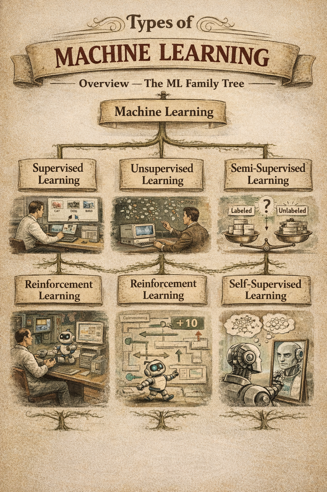
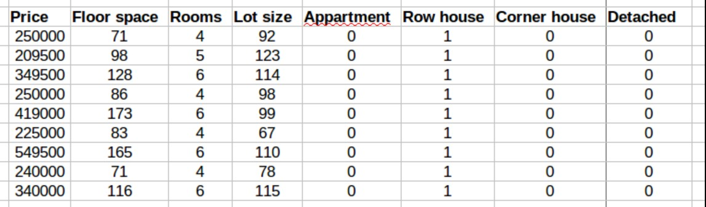
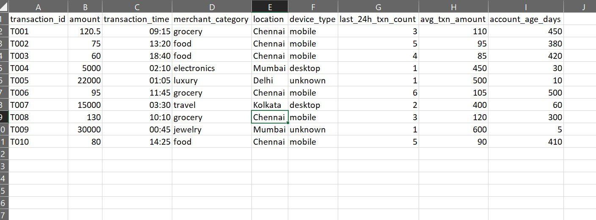

# Types of Machine Learning
## Complete Reference Guide

---

## Overview

Machine Learning is not one single technique. It is a family of approaches — each suited to different kinds of problems. The right type depends on: what data you have, whether you have labels, and what question you are trying to answer.



```
MACHINE LEARNING
│
├── 1. Supervised Learning        → Learns from labeled examples
│   ├── Classification            → Predicts a category
│   └── Regression                → Predicts a number
│
├── 2. Unsupervised Learning      → Finds hidden patterns, no labels
│   ├── Clustering                → Groups similar items
│   ├── Dimensionality Reduction  → Simplifies complex data
│   └── Anomaly Detection         → Finds unusual items
│
├── 3. Semi-Supervised Learning   → Mix of labeled + unlabeled data
│
├── 4. Reinforcement Learning     → Learns by reward and penalty
│
└── 5. Self-Supervised Learning   → Generates its own labels from data


```

---

## 1. Supervised Learning

### The Core Idea

The algorithm learns from a dataset where every example has both an **input** and a **correct answer (label)**. The model learns the mapping between inputs and answers, then applies that mapping to new unseen inputs.

Think of it as studying with an answer key — you see the question and the answer repeatedly until you can answer new questions on your own.

### When to Use It

Use supervised learning when:
- You know what you want to predict
- You have historical data with known outcomes
- You can afford to label your training data

### The Two Tasks

#### Classification — Predict a Category

| Example | Input | Output |
|---|---|---|
| Email spam filter | Email text | Spam / Not Spam |
| Medical diagnosis | Patient symptoms | Disease / No Disease |
| Image recognition | Photo | Cat / Dog / Car |
| Loan approval | Financial history | Approve / Reject |
| Sentiment analysis | Review text | Positive / Negative |

The output is one of a fixed set of categories.

#### Regression — Predict a Number

| Example | Input | Output |
|---|---|---|
| House price prediction | Size, location, rooms | Price in dollars |
| Stock price prediction | Historical prices | Tomorrow's price |
| Temperature forecast | Weather patterns | Temperature (°C) |
| Salary prediction | Experience, role | Annual salary |
| Sales forecasting | Past sales data | Next month's revenue |

The output is a continuous numerical value.



### How Training Works

```
Training:
  Input (features)  +  Label (correct answer)  →  Algorithm  →  Learns pattern

  Email text              "SPAM"                   Decision    Understands
  + word count    +     "NOT SPAM"          →      Tree    →  what spam looks like


Prediction:
  New Input (no label)  →  Trained Model  →  Prediction

  New email             →  Spam Filter    →  "SPAM" (94% confidence)
```

### Common Supervised Learning Algorithms

| Algorithm | Best For | Complexity |
|---|---|---|
| Linear Regression | Predicting numbers with linear relationships | Simple |
| Logistic Regression | Binary classification | Simple |
| Decision Tree | Classification and regression | Medium |
| Random Forest | Robust classification and regression | Medium |
| Support Vector Machine | High-dimensional classification | Medium |
| Neural Network | Complex patterns, images, language | Complex |
| K-Nearest Neighbors | Simple classification | Simple |

### Strengths and Weaknesses

| Strengths | Weaknesses |
|---|---|
| High accuracy with good labels | Requires labeled data (expensive) |
| Clear, measurable performance | Model only as good as the labels |
| Wide range of algorithms | Can overfit on small datasets |
| Well-understood mathematically | May not generalize to new patterns |

---

## 2. Unsupervised Learning

### The Core Idea

There are no labels. The algorithm is given raw data and must discover hidden patterns, structures, or groupings entirely on its own.

Think of it as being handed a pile of documents with no titles and asked to sort them into topics — you figure out the categories yourself.

### When to Use It

Use unsupervised learning when:
- You do not have labeled data
- You want to explore and understand your data
- You are looking for hidden structure or anomalies
- Labeling would be too expensive or impractical



### The Three Tasks

#### Clustering — Group Similar Items

The algorithm groups data points so that items within a group are more similar to each other than to items in other groups.

| Example | Data | Groups Found |
|---|---|---|
| Customer segmentation | Purchase behavior | Budget / Regular / Premium |
| Document grouping | News articles | Sports / Politics / Tech |
| Image compression | Pixel colors | Similar color clusters |
| Gene analysis | DNA sequences | Related genetic groups |

#### Dimensionality Reduction — Simplify Complex Data

Real-world data often has hundreds or thousands of features (columns). Dimensionality reduction compresses this into fewer features while preserving the important information.

| Example | Original Features | Reduced To |
|---|---|---|
| Face recognition | 10,000 pixels | 50 key features |
| Survey responses | 200 questions | 5 underlying themes |
| Financial data | 500 indicators | 10 key factors |
| Text documents | 50,000 words | 100 topics |

#### Anomaly Detection — Find What Does Not Fit

The algorithm learns what "normal" looks like, then flags anything unusual.

| Example | Normal Pattern | Anomaly |
|---|---|---|
| Credit card fraud | Regular spending locations | Purchase in 3 countries in 1 hour |
| Network security | Normal traffic patterns | Unusual data transfer |
| Manufacturing | Standard product dimensions | Defective item |
| Health monitoring | Normal vital signs | Irregular heartbeat |

### Common Unsupervised Learning Algorithms

| Algorithm | Task | Use Case |
|---|---|---|
| K-Means | Clustering | Customer segmentation |
| DBSCAN | Clustering | Geographic data, noise-tolerant grouping |
| Hierarchical Clustering | Clustering | Gene analysis, dendrograms |
| PCA (Principal Component Analysis) | Dimensionality Reduction | Feature compression |
| t-SNE | Dimensionality Reduction | Data visualization |
| Autoencoder | Dimensionality Reduction | Feature learning, compression |
| Isolation Forest | Anomaly Detection | Fraud detection |

### Strengths and Weaknesses

| Strengths | Weaknesses |
|---|---|
| No labeling cost | Harder to evaluate performance |
| Discovers unexpected patterns | Results can be ambiguous |
| Works with any raw data | Algorithm choice affects outcome significantly |
| Useful for exploration | Cannot predict specific labeled outcomes |

---

## 3. Semi-Supervised Learning

### The Core Idea

A small amount of labeled data is combined with a large amount of unlabeled data. The model learns from the labeled examples first, then uses that knowledge to make sense of the unlabeled data.

This is the practical middle ground — labeling all data is expensive, but having some labels improves accuracy over pure unsupervised learning.

### When to Use It

Use semi-supervised learning when:
- Labeling all your data would be too costly
- You have a large amount of unlabeled data available
- Even a small amount of labeled data is available

### Real-World Examples

| Domain | Labeled Data | Unlabeled Data |
|---|---|---|
| Medical imaging | 200 scans labeled by doctors | 50,000 unlabeled scans |
| Web content moderation | 1,000 reviewed posts | 10 million posts |
| Speech recognition | 100 hours transcribed | 10,000 hours of audio |
| Product quality | 500 inspected items | 100,000 items |

### How It Works

```
Step 1:  Train on labeled data
         500 labeled medical scans  →  Initial model

Step 2:  Apply to unlabeled data
         Model labels the 50,000 unlabeled scans with confidence scores

Step 3:  Add high-confidence predictions as new labels
         Labels scans where model is > 95% confident

Step 4:  Retrain with expanded dataset
         Better model with effectively more labeled data
```

### Common Algorithms

| Algorithm | Description |
|---|---|
| Label Propagation | Spreads labels from labeled to unlabeled points |
| Label Spreading | Similar, but handles noisy labels better |
| Self-Training | Model labels unlabeled data, adds confident labels to training set |
| Graph-Based Methods | Uses relationships between data points to propagate labels |

---

## 4. Reinforcement Learning

### The Core Idea

An **agent** takes actions in an **environment**. Good actions receive a **reward**. Bad actions receive a **penalty**. Through trial and error over many episodes, the agent learns a **policy** — a strategy that maximizes total reward over time.

There is no dataset of correct answers. The agent learns entirely from experience.

### The Key Components

| Component | What It Is | Example (Game) |
|---|---|---|
| **Agent** | The AI making decisions | The game player |
| **Environment** | The world the agent acts in | The game itself |
| **State** | What the agent currently observes | Current game screen |
| **Action** | What the agent chooses to do | Move left, jump, shoot |
| **Reward** | Score for an action outcome | +10 for winning, -5 for losing |
| **Policy** | The learned strategy | "In this state, do this action" |

### The Learning Loop

```
Observe State  →  Choose Action  →  Environment Changes
      ↑                                      │
      │                                      ↓
Update Policy  ←  Learn from Reward  ←  Receive Reward/Penalty
```

### When to Use It

Use reinforcement learning when:
- There is a clear objective to maximize (a score, a goal)
- You can simulate the environment for training
- Sequential decision-making is required
- No labeled dataset of correct actions exists

### Real-World Examples

| Domain | Agent | Environment | Reward |
|---|---|---|---|
| Games | AI player | Game engine | Game score |
| Self-driving cars | Car controller | Road simulator | Safe driving = +reward |
| Robotics | Robot arm | Physical world | Task completed = +reward |
| Trading | Trading bot | Stock market | Profit = +reward |
| ChatGPT (RLHF) | Language model | Human feedback | Human approval = +reward |

### Common Algorithms

| Algorithm | Description |
|---|---|
| Q-Learning | Learns value of each action in each state |
| Deep Q-Network (DQN) | Q-Learning with a neural network (used by Atari AI) |
| Policy Gradient | Directly learns the policy |
| PPO (Proximal Policy Optimization) | Used to train ChatGPT with human feedback |
| AlphaGo / AlphaZero | Mastered Go, Chess, Shogi through self-play |

### Strengths and Weaknesses

| Strengths | Weaknesses |
|---|---|
| No labeled data needed | Requires many iterations (slow) |
| Can surpass human performance | Hard to define the right reward function |
| Handles sequential decisions | Unsafe to train directly in real world |
| Learns strategies humans never considered | High computational cost |

---

## 5. Self-Supervised Learning

### The Core Idea

The algorithm creates its own labels from the input data. No human labeling is required. The model is given a task where the answer is hidden within the data itself — for example, predicting a word that has been masked, or predicting the next word in a sentence.

This is how ChatGPT, Claude, Gemini, and every modern large language model is trained.

### How It Works

```
Original Text:
  "The quick brown fox jumps over the lazy dog"

Self-Supervised Task (Masked Language Modeling):
  "The quick [MASK] fox jumps over the lazy dog"
  → Model predicts: "brown" ✓

Self-Supervised Task (Next Word Prediction):
  "The quick brown fox"
  → Model predicts: "jumps" ✓

After billions of such tasks:
  → Model deeply understands grammar, facts, reasoning, and language
```

### Why It Is Powerful

- Uses the entire internet as training data — no labeling cost
- Learns language, facts, code, math — everything written in text
- Produces models that generalize to almost any task
- Foundation for GPT, Claude, Gemini, BERT, LLaMA

### Real-World Examples

| Model | Self-Supervised Task | What It Became |
|---|---|---|
| GPT series | Predict next word | ChatGPT — best language generation |
| BERT | Predict masked words | Google Search improvements |
| Claude | Predict next word + RLHF | Conversational AI assistant |
| SimCLR | Predict if two image crops are the same image | Image feature learning without labels |

---

## 6. Side-by-Side Comparison

| Feature | Supervised | Unsupervised | Semi-Supervised | Reinforcement | Self-Supervised |
|---|---|---|---|---|---|
| **Labels required** | Yes, all data | None | Some | None | None (self-generated) |
| **Human involvement** | High | Low | Medium | Low | Low |
| **Output type** | Prediction | Patterns / Groups | Prediction | Actions / Policy | Representations |
| **Cost of data** | High | Low | Medium | Low | Low |
| **Typical use** | Predict known outcome | Explore data | Label-scarce domains | Sequential decisions | Language / vision models |
| **Example** | Spam detection | Customer grouping | Medical imaging | Game AI, ChatGPT training | GPT, Claude, Gemini |
| **Evaluation** | Accuracy, F1, RMSE | Silhouette score | Accuracy | Cumulative reward | Downstream task accuracy |

---

## 7. Choosing the Right Type

```
START
  │
  ├── Do you have labeled training data?
  │     │
  │     ├── YES ──► Is it ALL labeled?
  │     │               ├── YES ──► SUPERVISED LEARNING
  │     │               └── NO  ──► SEMI-SUPERVISED LEARNING
  │     │
  │     └── NO ───► Are you making sequential decisions?
  │                     ├── YES ──► REINFORCEMENT LEARNING
  │                     └── NO  ──► UNSUPERVISED LEARNING
  │                                 OR SELF-SUPERVISED LEARNING
```

### Quick Decision Guide

| Situation | Recommended Type |
|---|---|
| I have labeled historical data and want to predict outcomes | Supervised |
| I want to explore my data and find hidden groups | Unsupervised |
| I have a lot of data but only some is labeled | Semi-Supervised |
| I want AI to learn a strategy through trial and error | Reinforcement |
| I want to train on raw text/images without human labels | Self-Supervised |

---

## 8. Summary

| Type | One-Line Summary |
|---|---|
| **Supervised** | Learns from examples where the answer is known |
| **Unsupervised** | Discovers hidden structure in data with no labels |
| **Semi-Supervised** | Uses a small amount of labels to guide learning on lots of unlabeled data |
| **Reinforcement** | Learns by taking actions and receiving reward or penalty |
| **Self-Supervised** | Creates its own training signal — the foundation of modern LLMs |

---

