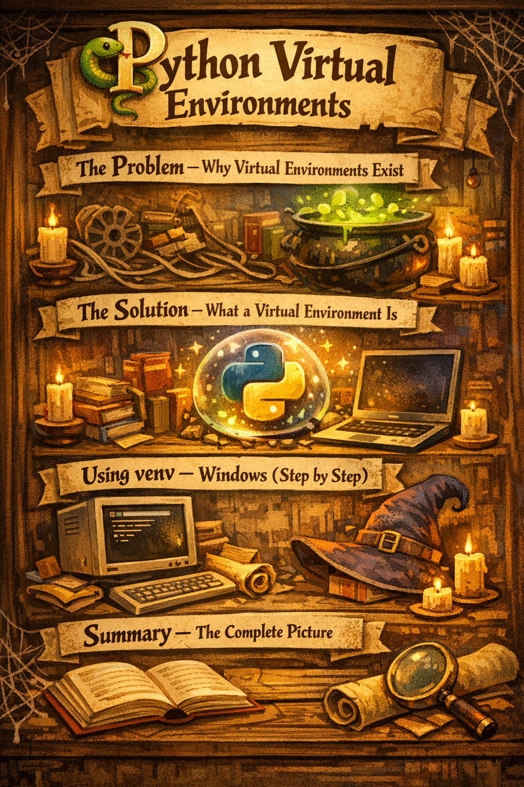

# 🐍 Python Virtual Environments
## Why Every Project Needs Its Own Environment


---

> **What is this guide?**
> This guide explains why Python virtual environments matter, how to create and manage them,
> and shows step-by-step commands for every major tool and operating system.
> Click any section title below to expand or collapse it.

---

<details>
<summary><h2>📌 1. The Problem — Why Virtual Environments Exist</h2></summary>

### Imagine This Situation

You are working on two Python projects on the same computer:

| Project | Requires |
|---|---|
| **Project A** — Old web app | `Django 3.2` |
| **Project B** — New web app | `Django 5.0` |

If you install both versions globally, they **conflict**. Only one version of Django can be installed system-wide at a time.

```
WITHOUT virtual environments:
  pip install django==3.2   ✓
  pip install django==5.0   ✗ Overwrites 3.2 — now Project A breaks!
```

### The Global Python Problem

When you run `pip install` without a virtual environment, packages go into your **global Python installation** — shared across ALL projects on your machine.

```
Global Python
│
├── Django 5.0        ← Project B needs this
├── Django 3.2 ???    ← Project A needs this — CONFLICT!
├── numpy 1.24
├── requests 2.28
└── ... (everything mixed together)
```

### Real Problems This Causes

- **Version conflicts** — Project A needs `requests 2.28`, Project B needs `requests 2.31`
- **Broken installs** — Installing for one project silently breaks another
- **Polluted system Python** — Hundreds of packages from all projects mixed together
- **Works on my machine problem** — Different teammates have different global packages
- **Deployment failures** — You don't know exactly which packages your app truly needs

</details>

---

<details>
<summary><h2>✅ 2. The Solution — What a Virtual Environment Is</h2></summary>

### Definition

A **virtual environment** is an **isolated, self-contained Python installation** created specifically for one project.

Each virtual environment has:
- Its own Python interpreter
- Its own `pip`
- Its own folder of installed packages
- Complete isolation from every other environment

```
WITH virtual environments:

project-a/
└── venv/                  ← Isolated environment for Project A
    └── Django 3.2 ✓
    └── requests 2.28 ✓

project-b/
└── venv/                  ← Isolated environment for Project B
    └── Django 5.0 ✓
    └── requests 2.31 ✓

No conflict. Each project has exactly what it needs.
```

### The Simple Analogy

> Think of a virtual environment like a **separate room** for each project.
> Each room has its own furniture (packages), its own rules (versions), and its own door.
> What you bring into one room does not affect any other room.

### Benefits at a Glance

| Benefit | Without venv | With venv |
|---|---|---|
| Version isolation | ✗ All projects share one version | ✓ Each project has its own version |
| Clean dependencies | ✗ Everything mixed together | ✓ Only what this project needs |
| Reproducibility | ✗ Hard to recreate exactly | ✓ `requirements.txt` captures everything |
| Team consistency | ✗ Different on each machine | ✓ Same environment everywhere |
| Safe experimentation | ✗ May break other projects | ✓ Sandboxed — nothing else affected |

</details>

---

<details>
<summary><h2>🛠️ 3. Tool Options — Which One Should You Use?</h2></summary>

Python has several tools for managing environments. Here is a clear comparison:

| Tool | Built-in? | Best For | Command |
|---|---|---|---|
| **venv** | ✓ Yes (Python 3.3+) | General Python projects | `python -m venv` |
| **virtualenv** | ✗ Install separately | Faster creation, Python 2 support | `virtualenv` |
| **conda** | ✗ Install Anaconda/Miniconda | Data science, ML, non-Python packages | `conda create` |
| **pipenv** | ✗ Install separately | Auto-manages venv + Pipfile | `pipenv` |
| **poetry** | ✗ Install separately | Modern packaging + dependency mgmt | `poetry new` |

### Recommendation for This Course

| If you are... | Use |
|---|---|
| New to Python | `venv` (built-in, simple, no extra install) |
| Doing ML/Data Science | `conda` (handles numpy, cuda, non-Python packages) |
| Building a professional package | `poetry` |

> This guide covers **`venv`** (recommended for beginners) and **`conda`** (recommended for ML).

</details>

---

<details>
<summary><h2>🪟 4. Using venv — Windows (Step by Step)</h2></summary>

### Prerequisites
- Python installed → verify with: `python --version`
- `venv` is built into Python 3.3+ — no installation needed

---

### Step 1 — Create Your Project Folder

```cmd
mkdir my_project
cd my_project
```

---

### Step 2 — Create the Virtual Environment

```cmd
python -m venv venv
```

> This creates a folder called `venv` inside your project.
> You can name it anything, but `venv` or `.venv` is the convention.

**What gets created:**
```
my_project/
└── venv/
    ├── Scripts/          ← activation scripts, pip, python
    ├── Lib/              ← installed packages go here
    └── pyvenv.cfg        ← environment configuration
```

---

### Step 3 — Activate the Environment

```cmd
venv\Scripts\activate
```

**You will see your prompt change:**
```
(venv) C:\Users\YourName\my_project>
```

The `(venv)` prefix means the environment is active. Now any `pip install` goes into THIS environment only.

---

### Step 4 — Install Packages

```cmd
pip install numpy pandas scikit-learn matplotlib
```

Packages install ONLY into the active virtual environment — not globally.

---

### Step 5 — Verify Installation

```cmd
pip list
```

You will see only the packages installed in this environment — a clean, minimal list.

---

### Step 6 — Save Your Dependencies

```cmd
pip freeze > requirements.txt
```

This creates a `requirements.txt` file listing every package and its exact version.
Share this file with your team or use it for deployment.

**Example `requirements.txt`:**
```
numpy==1.26.2
pandas==2.1.3
scikit-learn==1.3.2
matplotlib==3.8.2
```

---

### Step 7 — Deactivate the Environment

```cmd
deactivate
```

The `(venv)` prefix disappears. You are back to global Python.

---

### Step 8 — Recreate Environment from requirements.txt

```cmd
python -m venv venv
venv\Scripts\activate
pip install -r requirements.txt
```

This is how teammates set up the same environment on their machines.

---

### Common Windows Issues

| Problem | Fix |
|---|---|
| `python` not found | Use `py` instead of `python` |
| Activation blocked by policy | Run: `Set-ExecutionPolicy RemoteSigned -Scope CurrentUser` |
| `venv\Scripts\activate` not found | Recreate with `python -m venv venv` |

</details>

---

<details>
<summary><h2>🍎 5. Using venv — macOS (Step by Step)</h2></summary>

### Prerequisites
- Python 3 installed → verify with: `python3 --version`
- If not installed: `brew install python3` (requires Homebrew)

---

### Step 1 — Create Your Project Folder

```bash
mkdir my_project
cd my_project
```

---

### Step 2 — Create the Virtual Environment

```bash
python3 -m venv venv
```

**What gets created:**
```
my_project/
└── venv/
    ├── bin/              ← activate script, pip, python
    ├── lib/              ← installed packages go here
    └── pyvenv.cfg
```

---

### Step 3 — Activate the Environment

```bash
source venv/bin/activate
```

**Prompt changes to:**
```
(venv) username@mac my_project %
```

---

### Step 4 — Install Packages

```bash
pip install numpy pandas scikit-learn matplotlib
```

---

### Step 5 — Save Dependencies

```bash
pip freeze > requirements.txt
```

---

### Step 6 — Deactivate

```bash
deactivate
```

---

### Step 7 — Recreate from requirements.txt

```bash
python3 -m venv venv
source venv/bin/activate
pip install -r requirements.txt
```

</details>

---

<details>
<summary><h2>🐧 6. Using venv — Linux / Ubuntu (Step by Step)</h2></summary>

### Prerequisites

```bash
# Install Python and venv support
sudo apt update
sudo apt install python3 python3-pip python3-venv -y

# Verify
python3 --version
```

---

### Step 1 — Create Project Folder

```bash
mkdir my_project && cd my_project
```

---

### Step 2 — Create the Virtual Environment

```bash
python3 -m venv venv
```

---

### Step 3 — Activate

```bash
source venv/bin/activate
```

**Prompt becomes:**
```
(venv) user@ubuntu:~/my_project$
```

---

### Step 4 — Install Packages

```bash
pip install numpy pandas scikit-learn matplotlib
```

---

### Step 5 — Save and Share Dependencies

```bash
pip freeze > requirements.txt
cat requirements.txt   # view the file
```

---

### Step 6 — Deactivate

```bash
deactivate
```

---

### Step 7 — Recreate

```bash
python3 -m venv venv
source venv/bin/activate
pip install -r requirements.txt
```

</details>

---

<details>
<summary><h2>🔬 7. Using conda — For Machine Learning & Data Science</h2></summary>

### Why conda for ML?

`venv` is great for pure Python projects. But ML projects often need:
- `numpy`, `scipy` with compiled C extensions
- CUDA (for GPU computing)
- Non-Python packages like `libsvm`, `ffmpeg`

`conda` handles all of these natively.

---

### Step 1 — Install Miniconda

Download from: [https://docs.conda.io/en/latest/miniconda.html](https://docs.conda.io/en/latest/miniconda.html)

After install, verify:
```bash
conda --version
```

---

### Step 2 — Create a New Environment

```bash
# Basic: with just a Python version
conda create --name ml_project python=3.11

# With packages right away (recommended for ML)
conda create --name ml_project python=3.11 numpy pandas scikit-learn matplotlib jupyter
```

---

### Step 3 — Activate the Environment

```bash
# macOS / Linux
conda activate ml_project

# Windows
conda activate ml_project
```

**Prompt becomes:**
```
(ml_project) username@machine:~$
```

---

### Step 4 — Install More Packages

```bash
# Install via conda (preferred — handles C dependencies)
conda install seaborn scipy

# Or via pip inside conda (for packages not in conda)
pip install some-package
```

---

### Step 5 — Install Jupyter in the Environment

```bash
conda install jupyter notebook ipykernel
python -m ipykernel install --user --name=ml_project --display-name "Python (ml_project)"
```

Now when you open Jupyter, you can select your environment as the kernel.

---

### Step 6 — Export the Environment

```bash
# Save full environment (conda + pip packages)
conda env export > environment.yml
```

**Example `environment.yml`:**
```yaml
name: ml_project
channels:
  - defaults
  - conda-forge
dependencies:
  - python=3.11
  - numpy=1.26.2
  - pandas=2.1.3
  - scikit-learn=1.3.2
  - matplotlib=3.8.2
  - pip:
    - some-pip-package==1.0.0
```

---

### Step 7 — Deactivate

```bash
conda deactivate
```

---

### Step 8 — Recreate from environment.yml

```bash
conda env create -f environment.yml
conda activate ml_project
```

---

### Step 9 — List and Delete Environments

```bash
# List all environments
conda env list

# Delete an environment
conda remove --name ml_project --all
```

</details>

---

<details>
<summary><h2>📁 8. Project Structure Best Practices</h2></summary>

### Recommended Folder Layout

```
my_project/
│
├── venv/                  ← Virtual environment (NEVER commit this to Git)
│
├── src/                   ← Your Python source code
│   ├── main.py
│   ├── model.py
│   └── utils.py
│
├── data/                  ← Datasets (add to .gitignore if large)
│   ├── raw/
│   └── processed/
│
├── notebooks/             ← Jupyter notebooks
│   └── exploration.ipynb
│
├── tests/                 ← Unit tests
│   └── test_model.py
│
├── requirements.txt       ← Package list (ALWAYS commit this)
├── .gitignore             ← Ignore venv, __pycache__, .env
└── README.md              ← Project description
```

---

### The .gitignore File

**Always add your virtual environment to `.gitignore`** — never commit it to Git.

```gitignore
# Virtual environments
venv/
.venv/
env/
ENV/

# Python cache
__pycache__/
*.pyc
*.pyo
*.pyd

# Jupyter checkpoints
.ipynb_checkpoints/

# Environment variables
.env

# OS files
.DS_Store
Thumbs.db
```

**Why not commit venv?**
- It is hundreds of megabytes
- It contains machine-specific compiled files
- The `requirements.txt` is enough to recreate it on any machine

---

### The Golden Rule

```
✅ ALWAYS commit:   requirements.txt (or environment.yml)
✅ ALWAYS commit:   .gitignore
✅ ALWAYS commit:   your source code

❌ NEVER commit:    venv/ folder
❌ NEVER commit:    .env files (secrets, API keys)
❌ NEVER commit:    large data files
```

</details>

---

<details>
<summary><h2>🔁 9. Day-to-Day Workflow</h2></summary>

### Starting Work Each Day

```bash
# 1. Navigate to your project
cd my_project

# 2. Activate your environment (do this EVERY time)
source venv/bin/activate        # macOS/Linux
venv\Scripts\activate           # Windows

# 3. Verify you are in the right environment
which python                    # macOS/Linux
where python                    # Windows

# 4. Start working
jupyter notebook
# or
python src/main.py
```

---

### Adding a New Package

```bash
# 1. Make sure environment is active (see (venv) in prompt)

# 2. Install the package
pip install new-package

# 3. Update requirements.txt immediately
pip freeze > requirements.txt

# 4. Commit the updated requirements.txt to Git
git add requirements.txt
git commit -m "Add new-package to requirements"
```

---

### Onboarding a New Teammate

```bash
# 1. Clone the repository
git clone https://github.com/your/project.git
cd project

# 2. Create a fresh virtual environment
python3 -m venv venv

# 3. Activate it
source venv/bin/activate

# 4. Install all dependencies from requirements.txt
pip install -r requirements.txt

# 5. Start working
jupyter notebook
```

---

### Switching Between Projects

```bash
# Leave project A
deactivate

# Go to project B
cd ~/projects/project_b
source venv/bin/activate    # Now in project B's environment

# Back to project A
deactivate
cd ~/projects/project_a
source venv/bin/activate    # Back in project A's environment
```

Each project has its own isolated environment. Switching is clean and instant.

</details>

---

<details>
<summary><h2>⚡ 10. Quick Reference — All Commands in One Place</h2></summary>

### venv Commands

| Action | Windows | macOS / Linux |
|---|---|---|
| Create environment | `python -m venv venv` | `python3 -m venv venv` |
| Activate | `venv\Scripts\activate` | `source venv/bin/activate` |
| Deactivate | `deactivate` | `deactivate` |
| Install package | `pip install package` | `pip install package` |
| Install from file | `pip install -r requirements.txt` | `pip install -r requirements.txt` |
| Save dependencies | `pip freeze > requirements.txt` | `pip freeze > requirements.txt` |
| List packages | `pip list` | `pip list` |
| Remove environment | Delete the `venv/` folder | `rm -rf venv/` |

---

### conda Commands

| Action | Command |
|---|---|
| Create environment | `conda create --name myenv python=3.11` |
| Activate | `conda activate myenv` |
| Deactivate | `conda deactivate` |
| Install package | `conda install package` |
| Export environment | `conda env export > environment.yml` |
| Recreate from file | `conda env create -f environment.yml` |
| List all environments | `conda env list` |
| Delete environment | `conda remove --name myenv --all` |

---

### Check Active Environment

```bash
# See which Python is active
which python        # macOS/Linux → should show path inside venv/
where python        # Windows

# See all installed packages in current env
pip list

# See current environment info
python -c "import sys; print(sys.prefix)"
```

</details>

---

<details>
<summary><h2>❓ 11. Troubleshooting Common Issues</h2></summary>

### Issue 1 — Activation Not Working on Windows

```
Error: "cannot be loaded because running scripts is disabled"
```
**Fix:**
```powershell
Set-ExecutionPolicy RemoteSigned -Scope CurrentUser
```

---

### Issue 2 — Wrong Python Version in venv

**Problem:** Your venv uses Python 3.9 but you want 3.11.

**Fix:**
```bash
# Specify the Python version explicitly
python3.11 -m venv venv

# Or on Windows
py -3.11 -m venv venv
```

---

### Issue 3 — pip installs globally even with venv active

**Check:** Is the environment actually active? You should see `(venv)` in your prompt.

```bash
# Confirm which pip is being used
which pip       # macOS/Linux — should point inside your venv/
where pip       # Windows

# If wrong, reactivate
deactivate
source venv/bin/activate
```

---

### Issue 4 — requirements.txt has wrong packages

**Problem:** `pip freeze` includes development tools you don't need in production.

**Better approach — use pip-tools:**
```bash
pip install pip-tools

# Create requirements.in with only your direct dependencies
echo "numpy" > requirements.in
echo "pandas" >> requirements.in
echo "scikit-learn" >> requirements.in

# Compile exact pinned versions
pip-compile requirements.in
# Generates requirements.txt with all transitive dependencies pinned
```

---

### Issue 5 — Jupyter not seeing the virtual environment

```bash
# Inside your active venv, install ipykernel
pip install ipykernel

# Register the environment as a Jupyter kernel
python -m ipykernel install --user --name=myenv --display-name "Python (myenv)"

# Now launch Jupyter and select "Python (myenv)" as the kernel
jupyter notebook
```

---

### Issue 6 — venv folder accidentally committed to Git

```bash
# Remove from Git tracking (keeps the folder locally)
git rm -r --cached venv/

# Add to .gitignore
echo "venv/" >> .gitignore

# Commit the change
git add .gitignore
git commit -m "Remove venv from tracking, add to gitignore"
```

</details>

---

<details>
<summary><h2>📊 12. Summary — The Complete Picture</h2></summary>

### Why Virtual Environments

```
Without venv                        With venv
──────────────────────────          ──────────────────────────
One Python for all projects         One Python per project
Packages conflict and break         Packages fully isolated
Hard to reproduce exact setup       requirements.txt = exact blueprint
Upgrading one project breaks others Projects never interfere
"Works on my machine" problem       Same setup everywhere
```

### The 5-Step Habit

Every time you start a new Python project:

```
1. Create project folder
   mkdir my_project && cd my_project

2. Create virtual environment
   python3 -m venv venv

3. Activate it
   source venv/bin/activate        (macOS/Linux)
   venv\Scripts\activate           (Windows)

4. Install only what this project needs
   pip install package1 package2

5. Save dependencies immediately
   pip freeze > requirements.txt
```

Then add `venv/` to `.gitignore` and commit `requirements.txt`.

### One Sentence to Remember

> **One project = One virtual environment. Always.**

</details>

---

*This file uses standard `<details>` and `<summary>` HTML tags, which render as collapsible sections in GitHub, GitLab, Jupyter Notebook, VS Code preview, and most modern Markdown renderers.*
